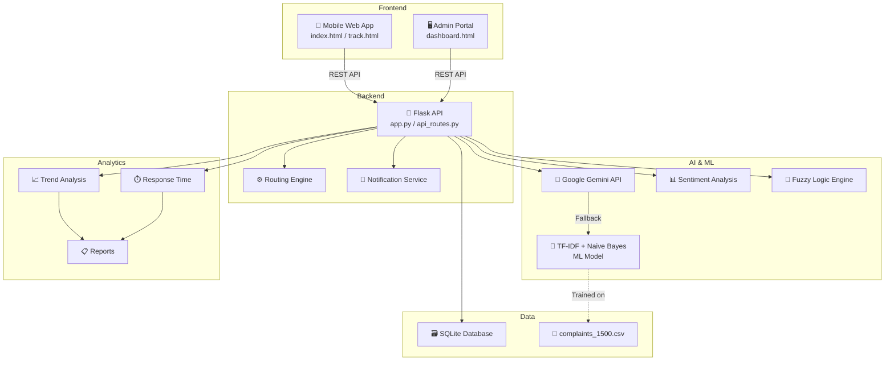

# 🏛️ Civic Grievance System — Complete Project Guide

## 📖 Overview

A full-stack civic grievance management platform that allows **citizens** to submit and track complaints, while **administrators** manage and resolve them. The system uses **AI (Google Gemini)** and **Machine Learning** to auto-classify complaints, assess urgency, and route them to the correct government department.

---

## 🏗️ Architecture



---

## 📁 Project Structure

```
civic-grievance-system/
├── backend/                    # Flask REST API
│   ├── app.py                  # Main server entry point
│   ├── api_routes.py           # All API endpoints (CRUD)
│   ├── config.py               # Configuration (DB path, API key)
│   ├── routing_engine.py       # Category → Department mapping
│   ├── notification_service.py # Status change notifications
│   └── requirements.txt        # Python dependencies
│
├── ml_engine/                  # AI & Machine Learning
│   ├── gemini_service.py       # 🤖 Google Gemini API integration
│   ├── train_model.py          # Train TF-IDF + Naive Bayes
│   ├── predict.py              # Predict complaint category
│   ├── sentiment_analysis.py   # Keyword-based urgency detection
│   ├── model.pkl               # Trained ML model (auto-generated)
│   └── vectorizer.pkl          # TF-IDF vectorizer (auto-generated)
│
├── soft_computing/             # Fuzzy Logic
│   └── fuzzy_priority_engine.py # Fuzzy priority scoring
│
├── analytics_engine/           # Data Analytics
│   ├── trend_analysis.py       # Complaint trends by category/time
│   ├── response_time.py        # Resolution time metrics
│   └── reports.py              # Aggregated analytics reports
│
├── database/                   # Data Storage
│   ├── schema.sql              # Database schema (4 tables)
│   ├── complaints_1500.csv     # Training dataset (1501 rows)
│   └── grievances.db           # SQLite DB (auto-created)
│
├── mobile_web_app/             # Citizen-Facing Frontend
│   ├── index.html              # Submit complaint form
│   ├── track.html              # Track complaint status
│   └── assets/
│       ├── css/style.css        # Premium dark UI design
│       └── js/
│           ├── script.js        # Form logic, API calls
│           └── voice_input.js   # Web Speech API (voice input)
│
├── admin_portal/               # Admin Dashboard Frontend
│   ├── dashboard.html          # Admin control panel
│   ├── css/admin_style.css     # Admin styles
│   └── js/
│       ├── dashboard.js        # Complaint management
│       └── analytics.js        # Chart.js analytics
│
├── tests/                      # Unit Tests
│   ├── test_api.py             # API endpoint tests
│   ├── test_routing.py         # Routing engine tests
│   └── test_ml.py              # ML + fuzzy logic tests
│
├── run_project.py              # One-click project launcher
└── docs/                       # Documentation & diagrams
```

---

## 🛠️ Technologies & APIs Used

### Backend
| Technology | Purpose | Version |
|---|---|---|
| **Python 3.x** | Core language | 3.8+ |
| **Flask** | REST API framework | ≥2.3 |
| **Flask-CORS** | Cross-origin requests | ≥4.0 |
| **SQLite3** | Lightweight database | Built-in |

### AI & Machine Learning
| Technology | Purpose |
|---|---|
| **Google Gemini API** | AI-powered complaint classification, urgency analysis, and response generation |
| **Scikit-learn (TF-IDF + Naive Bayes)** | Local ML fallback classifier trained on 1501 complaints |
| **Keyword-based Sentiment Analysis** | Urgency detection (Low/Medium/High) based on keywords |
| **Fuzzy Logic Engine** | Priority scoring using triangular membership functions |

### Frontend
| Technology | Purpose |
|---|---|
| **HTML5 / CSS3 / JavaScript** | Mobile-first web interface |
| **Web Speech API** | Voice input for complaint submission |
| **Nominatim (OpenStreetMap)** | Reverse geocoding (GPS to address) |
| **Chart.js** | Admin analytics charts |
| **CSS Animations & Glassmorphism** | Premium dark-themed UI |

### Dataset
| File | Rows | Columns | Categories |
|---|---|---|---|
| `complaints_1500.csv` | 1501 | `complaint_text`, `category` | Electricity, Garbage, Roads, Sanitation, Water |

---

## 🔑 API Endpoints

| Method | Endpoint | Description |
|---|---|---|
| `GET` | `/` | Welcome + endpoints list |
| `GET` | `/health` | Health check |
| `POST` | `/api/complaints` | Submit new complaint |
| `GET` | `/api/complaints` | List all complaints |
| `GET` | `/api/complaints/<id>` | Get complaint details |
| `GET` | `/api/complaints/search?q=` | Search by ID or phone |
| `PUT` | `/api/complaints/<id>/status` | Update status (admin) |
| `GET` | `/api/notifications` | Get notifications |
| `GET` | `/api/analytics/summary` | Analytics dashboard |

### Create Complaint (POST /api/complaints)
```json
{
  "name": "Ravi Kumar",
  "email": "ravi@example.com",
  "phone": "9876543210",
  "category": "roads",
  "location": "MG Road, Chennai",
  "description": "Large pothole causing accidents near bus stop"
}
```

**Response:**
```json
{
  "success": true,
  "complaint_id": "CG20260219160856A1B2",
  "department": "Public Works Department",
  "priority": "high",
  "status": "submitted"
}
```

---

## 🤖 AI API Integration (GLM + Gemini Fallback)

The system uses **GLM-5V-Turbo** as the primary AI provider for intelligent complaint analysis:

- **Complaint Classification**: Automatically categorizes complaint text into the correct department
- **Urgency Assessment**: Scores urgency 1-10 and determines priority (low/medium/high)
- **Smart Department Routing**: AI suggests the best government department
- **Fallback chain**:
    1. GLM API (primary)
    2. Gemini API (optional, if configured)
    3. Local TF-IDF + Naive Bayes ML fallback

**API Key Location**: `backend/config.py` → `GLM_API_KEY`

---

## 🗃️ Database Schema

### Tables
1. **complaints** — Stores all citizen grievances
   - Fields: `id`, `name`, `email`, `phone`, `category`, `location`, `description`, `department`, `priority`, `status`, `created_at`, `updated_at`, `resolved_at`

2. **status_history** — Tracks all status changes
   - Fields: `id`, `complaint_id`, `status`, `notes`, `changed_at`

3. **analytics** — Stores analytics events
   - Fields: `id`, `type`, `data`, `created_at`

4. **users** — Admin & user accounts
   - Fields: `id`, `username`, `password_hash`, `role`, `created_at`
   - Default admin: `admin` / (hash of `admin123`)

---

## 🚀 How to Run the Project

### Prerequisites
- Python 3.8 or higher
- pip (Python package manager)
- Web browser (Chrome/Edge/Firefox)

### Step 1: Install Dependencies
```bash
cd d:\civic-grievance-system\backend
pip install -r requirements.txt
```

### Step 2: Train the ML Model (first time only)
```bash
cd d:\civic-grievance-system\ml_engine
python train_model.py
```
This reads `complaints_1500.csv` (1501 rows) and trains a TF-IDF + Naive Bayes model.

### Step 3: Start the Backend Server
```bash
cd d:\civic-grievance-system\backend
python app.py
```
**Server starts at**: http://localhost:5000
> The database (`grievances.db`) is auto-created on first run.

### Step 4: Start the Frontend Server
```bash
cd d:\civic-grievance-system\mobile_web_app
python -m http.server 8000
```
**Frontend at**: http://localhost:8000

### Step 5: Open in Browser
- **Submit Complaint**: http://localhost:8000/index.html
- **Track Complaint**: http://localhost:8000/track.html
- **Admin Dashboard**: Open `admin_portal/dashboard.html` directly

### One-Click Launch (Alternative)
```bash
cd d:\civic-grievance-system
python run_project.py
```
This starts both servers and opens the browser automatically.

### Step 6: Run Tests
```bash
cd d:\civic-grievance-system
python -m pytest tests/ -v
```

---

## 📊 Complaint Categories (Dataset)

| Category | Example Complaints | Department |
|---|---|---|
| **Electricity** | Power cut, transformer noise, voltage fluctuation, street light | Electricity Board |
| **Roads** | Potholes, broken road, incomplete construction, footpath damaged | Public Works Department |
| **Water** | No water supply, pipe leakage, dirty water, low pressure | Water Supply Department |
| **Sanitation** | Drainage overflow, sewer blocked, public toilet, sewage problem | Sanitation Department |
| **Garbage** | Overflowing bins, waste on roadside, garbage not collected, bad smell | Sanitation Department |

---

## 🧪 Test Results

| Test Suite | Tests | Status |
|---|---|---|
| `test_routing.py` | 4 tests (all categories + case-insensitive + edge cases) | ✅ All Pass |
| `test_ml.py` | 10 tests (sentiment analysis + fuzzy priority engine) | ✅ All Pass |
| `test_api.py` | 7 tests (health, CRUD, search, analytics) | ✅ All Pass |
| ML Model Training | 1501 rows, 5 categories | ✅ Trained |
| AI API (GLM/Gemini) | classify + urgency analysis + fallback | ✅ Working |

---

## 🔧 Configuration

All configuration is in `backend/config.py`:

| Setting | Value | Purpose |
|---|---|---|
| `AI_PROVIDER` | `glm` / `gemini` / `auto` | Select AI provider |
| `GLM_API_KEY` | Your API key | GLM API authentication |
| `GLM_MODEL` | `glm-5v-turbo` | GLM model selection |
| `GLM_API_URL` | Chat completions endpoint | GLM API URL |
| `GEMINI_API_KEY` | Optional API key | Gemini fallback |
| `DATABASE_PATH` | `database/grievances.db` | SQLite database |
| `DATASET_PATH` | `database/complaints_1500.csv` | Training dataset |
| `ML_MODEL_PATH` | `ml_engine/model.pkl` | Trained classifier |
| `UPLOAD_FOLDER` | `uploads/` | File uploads |
| `MAX_CONTENT_LENGTH` | 5 MB | Max upload size |

---

## 📱 Features

### For Citizens (Mobile Web App)
- ✅ Submit complaints with form validation
- ✅ Voice input (Web Speech API)
- ✅ GPS geolocation auto-detect
- ✅ File/photo upload
- ✅ Track complaint by ID or phone
- ✅ View status timeline and history
- ✅ Save drafts in localStorage
- ✅ Department auto-assignment

### For Admins
- ✅ View all complaints dashboard
- ✅ Update complaint status
- ✅ Analytics (categories, resolution rates)
- ✅ Department-wise performance

### AI & Intelligence
- ✅ Google Gemini API for classification
- ✅ ML fallback (TF-IDF + Naive Bayes)
- ✅ Sentiment/urgency analysis
- ✅ Fuzzy logic priority scoring
- ✅ Auto department routing
